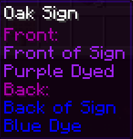
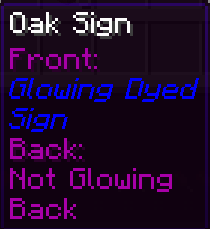

# Improved Signs 
This mod is only for Fabric/Quilt Servers(or Single-Player) and requires [Fabric API](https://modrinth.com/mod/fabric-api) or [Quilted Fabric API](https://modrinth.com/mod/qsl)

### Features
- **Sign & Item Frame Passthrough:** Access chests, shulker boxes, barrels, etc behind signs by right-clicking the sign
   - Interact with Item Frames normally by shift(sneak) + right-click
- **Invisible Item Frames** - Use Amethyst Shards to turn item frames invisible
   - You can configure it to use Glass Panes instead
- **Signs Retain** - Breaking a sign will retain that sign's text, color and glowing. Put the sign in a crafting window to reset it
- **Sign Copy** - Right-clicking a sign with a sign(or stack of signs) in your hand will copy the text to the held signs
- Tooltip text for Sign Copy and Retain is generated server-side, no client-side mod required

 
 - Stop Sign editor from opening when placing new signs
 - All features are configurable in `config/improvedsigns.json5`

### Shout-outs
- [Pillowsledder](https://bsky.app/profile/pillowsledder.bsky.social) for creating the excellent icons!
- Original Sign Retain functionality merged from [umollu's Sign Retain](https://www.curseforge.com/minecraft/mc-mods/sign-retain)
- Girafi for the idea for Passthrough Signs. Find their original mod for Forge [here](https://www.curseforge.com/minecraft/mc-mods/passthrough-signs)
- MeeniMc for contributing several version updates
- Jarva for many contributions to the mod
- Everyone else that has [contributed](https://github.com/CraftyCorvid/ImprovedSigns/graphs/contributors)